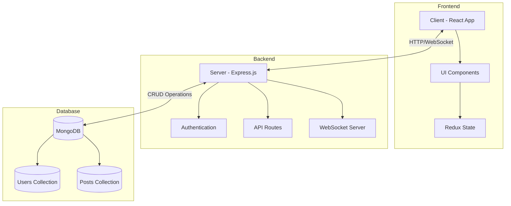
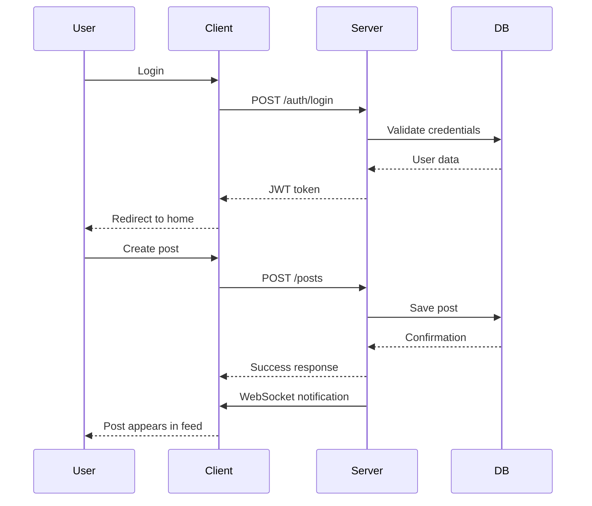
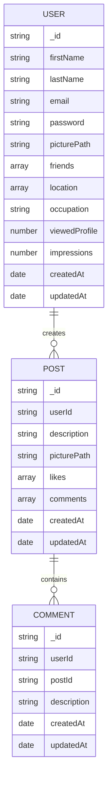

# KOOROKY MERN Social Media Application

A full-stack social media application built with the MERN stack (MongoDB, Express.js, React, Node.js) featuring real-time updates via WebSockets. This project demonstrates proper system design principles with comprehensive documentation.

> **Note**: This project is based on an existing MERN social media application codebase that has been significantly extended and enhanced by approximately 80-85%. The original codebase served as a foundation, while the current implementation includes substantial improvements in architecture, features, and system design.

> **Academic Project**: This project was developed as part of the System Design course taught by Dr. Saman Shishechi at Qazvin Islamic Azad University (QIAU). The course focused on applying system design principles to real-world applications, with this project serving as a practical implementation of those concepts.

## Features

- **User Authentication**: Secure login and registration system
- **Real-time Updates**: Live notifications and post updates using WebSockets
- **Profile Management**: Create and edit user profiles
- **Post Creation**: Share text and images with your network
- **Responsive Design**: Works on desktop and mobile devices
- **Error Handling**: Graceful error management with user-friendly messages
- **Theme Support**: Light and dark mode options

## Tech Stack

- **Frontend**: React, Redux, Material-UI
- **Backend**: Node.js, Express.js
- **Database**: MongoDB
- **Real-time Communication**: WebSockets
- **Authentication**: JWT (JSON Web Tokens)
- **Project Management**: Jira for agile development and task tracking
Update
## Project Documentation

This project includes comprehensive documentation in various formats:

- **[Final Project Report](systems%20design/14031010KoorokyProject.MehdiMaleki.final.pdf)**: Complete project documentation with all details
- **[System Design Final](systems%20design/14031010KoorokySDF.m.final.docx)**: Detailed system design document
- **[System Design Demo](systems%20design/14031010KoorokySDF.m.demo.pdf)**: Presentation of the system design
- **[System Design Markdown](systems%20design/14031010KoorokySD.m.final.md)**: System design in markdown format

## Project Management

This project was managed using Jira, following agile development practices:


The development process included:

- **Sprint Planning**: Regular sprint planning meetings to define goals and tasks
- **Task Tracking**: Detailed tracking of user stories and tasks in Jira
- **Progress Reporting**: Regular progress reports and burndown charts
- **Team Collaboration**: Efficient collaboration between team members


The Jira implementation helped maintain project transparency and ensured timely delivery of features.

## System Design Documentation

This project includes comprehensive system design documentation in the `systems design` directory:

- **[Architecture Diagram](server/AD.md)**: High-level system architecture showing component interactions
- **[Entity Relationship Diagram](server/ER.md)**: Database schema and relationships
- **[Use Case Diagram](server/UCD.md)**: User interactions and system functionality
- **[Sequence Diagrams](server/SL.md)**: Detailed flow of operations
- **[System Requirements](server/kooroky.md)**: Functional and non-functional requirements

### System Design Principles Applied

This project demonstrates several key system design principles:

1. **Separation of Concerns**: Clear separation between frontend, backend, and database layers
2. **Scalability**: Designed with horizontal scaling in mind
3. **Real-time Communication**: Efficient WebSocket implementation for live updates
4. **Error Handling**: Comprehensive error management across all layers
5. **Security**: JWT authentication and proper data validation
6. **Maintainability**: Well-organized codebase with clear documentation

## System Architecture



## Data Flow



## Prerequisites

Before you begin, ensure you have the following installed:
- Node.js (v14 or higher)
- MongoDB (v4.4 or higher)
- npm or yarn

## Installation

### Clone the Repository

```bash
git clone https://github.com/yourusername/mern-social-media.git
cd mern-social-media
```

### Backend Setup

1. Navigate to the server directory:
```bash
cd server
```

2. Install dependencies:
```bash
npm install
```

   This command will:
   - Read the `package.json` file in the server directory
   - Install all required dependencies listed in the file
   - Create a `node_modules` folder containing all installed packages
   - Generate a `package-lock.json` file to lock dependency versions

3. Create a `.env` file in the server directory with the following variables:
```
PORT=3001
MONGO_URL=your_mongodb_connection_string
JWT_SECRET=your_jwt_secret
```

4. Start the server:
```bash
npm start
```

   This will start the Express.js server on port 3001 (or the port specified in your .env file).

### Frontend Setup

1. Navigate to the client directory:
```bash
cd client
```

2. Install dependencies:
```bash
npm install
```

   This command will:
   - Read the `package.json` file in the client directory
   - Install all required dependencies listed in the file
   - Create a `node_modules` folder containing all installed packages
   - Generate a `package-lock.json` file to lock dependency versions

3. Create a `.env` file in the client directory with the following variables:
```
REACT_APP_API_URL=http://localhost:3001
REACT_APP_WS_URL=ws://localhost:3001
REACT_APP_NAME=Social Media App
REACT_APP_VERSION=1.0.0
REACT_APP_PUBLIC_FOLDER=http://localhost:3000/images/
```

4. Start the client:
```bash
npm start
```

   This will start the React development server on port 3000 and open the application in your default browser.

### Troubleshooting Installation Issues

If you encounter any issues during installation:

1. **Node.js Version**: Ensure you're using a compatible Node.js version (v14 or higher)
   ```bash
   node -v
   ```

2. **Clear npm Cache**: If you encounter dependency issues, try clearing the npm cache
   ```bash
   npm cache clean --force
   ```

3. **Delete node_modules**: If you continue to have issues, try deleting the node_modules folder and reinstalling
   ```bash
   rm -rf node_modules
   npm install
   ```

4. **Check for Errors**: Look for specific error messages in the terminal output that might indicate missing dependencies or version conflicts

## Usage

### Running the Application

1. Start the MongoDB service on your machine
2. Start the backend server (from the server directory)
3. Start the frontend application (from the client directory)
4. Open your browser and navigate to `http://localhost:3000`

### User Registration

1. Click on the "Register" button on the login page
2. Fill in your details (name, email, password)
3. Submit the form to create your account

### Creating Posts

1. Log in to your account
2. Navigate to the home page
3. Use the post creation form to share text or images
4. Your posts will appear in real-time for other users

### Profile Management

1. Click on your profile icon in the navigation bar
2. Select "Edit Profile" to update your information
3. Save your changes

### Real-time Features

The application uses WebSockets to provide real-time updates:
- New posts appear instantly without refreshing
- Profile updates are reflected immediately
- Connection issues are handled automatically with reconnection attempts

## Project Structure

```
mern-social-media/
├── client/                 # Frontend React application
│   ├── public/             # Static files
│   ├── src/                # Source files
│   │   ├── components/     # Reusable UI components
│   │   ├── hooks/          # Custom React hooks
│   │   ├── scenes/         # Page components
│   │   ├── state/          # Redux state management
│   │   ├── App.js          # Main application component
│   │   └── index.js        # Entry point
│   └── package.json        # Frontend dependencies
├── server/                 # Backend Node.js application
│   ├── controllers/        # Request handlers
│   ├── middleware/         # Custom middleware
│   ├── models/             # MongoDB models
│   ├── routes/             # API routes
│   ├── index.js            # Server entry point
│   └── package.json        # Backend dependencies
│   ├── AD.md               # Architecture Diagram
│   ├── ER.md               # Entity Relationship Diagram
│   ├── UCD.md              # Use Case Diagram
│   ├── SL.md               # Sequence Diagrams
│   ├── kooroky.md          # System Requirements
├── systems design/         # System design documentation
│   ├── assets/             # System design images and diagrams
│   ├── 14031010KoorokyProject.MehdiMaleki.final.pdf  # Final project report
│   ├── 14031010KoorokySDF.m.final.docx               # System design final document
│   ├── 14031010KoorokySDF.m.demo.pdf                 # System design demo
│   └── 14031010KoorokySD.m.final.md                  # System design markdown
└── README.md               # Project documentation
```

## System Design Files

The `systems design` directory contains detailed documentation of the application's architecture:

### [Architecture Diagram](systems%20design/AD.md)
- Component-level architecture
- Communication patterns
- Data flow between components
- External service integrations

### [Entity Relationship Diagram](systems%20design/ER.md)
- Database schema design
- Relationships between entities
- Data attributes and constraints
- Indexing strategy

### [Use Case Diagram](systems%20design/UCD.md)
- User interactions with the system
- System functionality
- Actor roles and permissions
- Use case scenarios

### [Sequence Diagrams](systems%20design/SL.md)
- Detailed operation flows
- Component interactions
- Message passing
- Timing of operations

### [System Requirements](systems%20design/kooroky.md)
- Functional requirements
- Non-functional requirements
- Performance criteria
- Security requirements

## Database Schema



## Error Handling

The application includes comprehensive error handling:
- Frontend error boundary to catch React errors
- Backend validation for API requests
- WebSocket connection error recovery
- User-friendly error messages

## Contributing

1. Fork the repository
2. Create your feature branch (`git checkout -b feature/amazing-feature`)
3. Commit your changes (`git commit -m 'Add some amazing feature'`)
4. Push to the branch (`git push origin feature/amazing-feature`)
5. Open a Pull Request

## Acknowledgments

- Material-UI for the component library
- MongoDB for the database
- Express.js for the backend framework
- React for the frontend framework
- The original MERN social media application codebase that served as a foundation for this project
- Jira for project management and agile development
- Dr. Saman Shishechi for teaching the System Design course at Qazvin Islamic Azad University (QIAU) 
