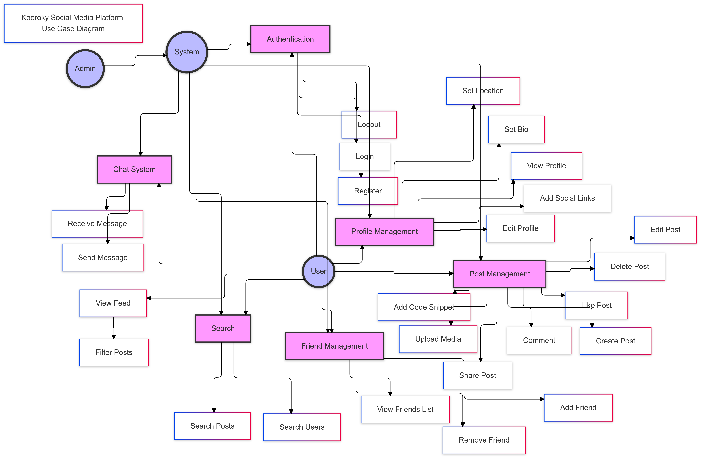
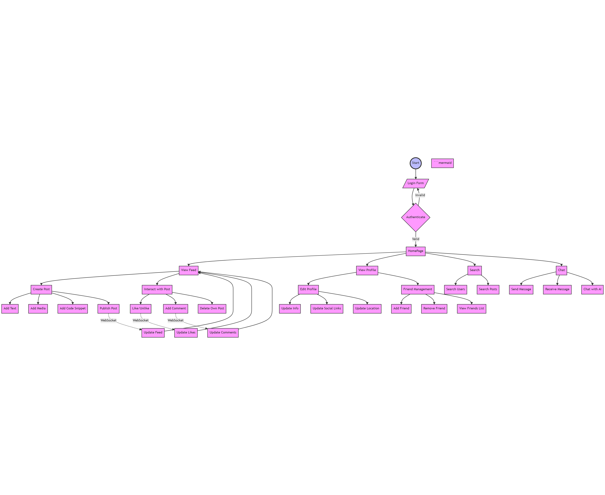
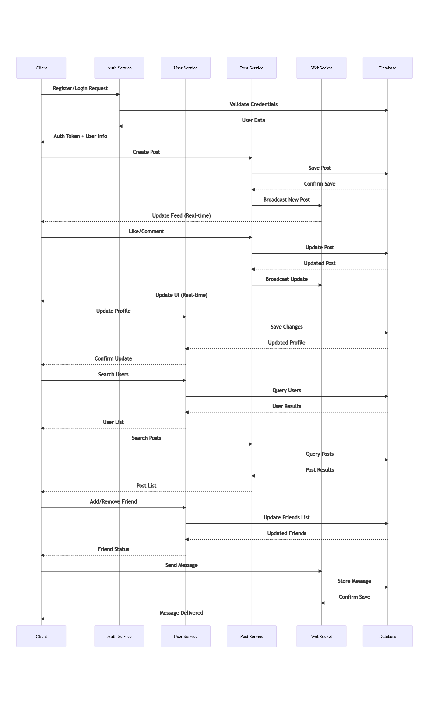
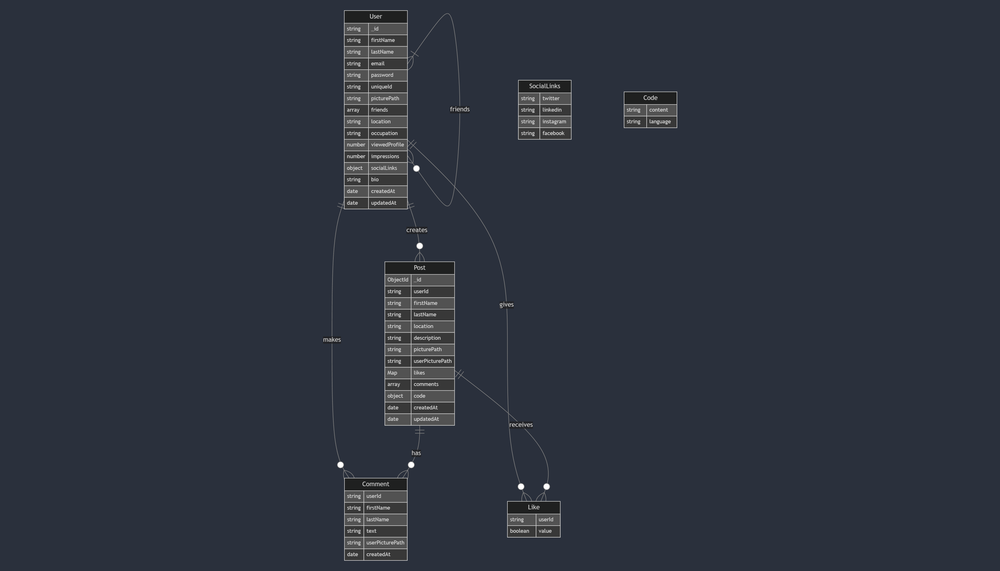

# Kooroky Social Media Platform

## Table of Contents
- Overview
- Project Scenario
  - Scenario
  - Objectives
  - Target Audience
  - Features and Services
  - Beneficiaries Desires
- Tech Stack
  - Core Components
    - Library Languages
    - Algorithms
    - Time and Date Handling
  - Data Handling
    - File Formats
    - Database Integration
  - Performance Optimization
  - Development
    - Build Systems
    - Documentation
    - Version Control
- Methodology
  - Scrum Methodology
    - Why Scrum?
    - Process
    - Team Structure
  - Phases

## Overview
Kooroky is a social media platform designed specifically for developers to share code snippets, technical posts, and connect with other developers. The platform combines traditional social media features with developer-specific functionality.

## Project Scenario

### Scenario
Kooroky provides a professional social networking platform where developers can:
- Share code snippets with syntax highlighting
- Create technical posts
- Network with other developers
- Get real-time updates
- Chat with AI assistance
- Manage professional profiles with social links

### Objectives
1. Create a developer-focused social platform
2. Enable seamless code sharing and discussion
3. Foster professional networking
4. Provide real-time interaction
5. Integrate AI-powered assistance

### Target Audience
- Software Developers
- IT Professionals
- Computer Science Students
- Tech Enthusiasts

### Features and Services
1. **User Management**
   - Authentication & Authorization
   - Profile Management
   - Social Links Integration
   - Friend System

2. **Content Management**
   - Post Creation/Editing
   - Code Snippet Sharing
   - Syntax Highlighting
   - Image Upload

3. **Real-time Features**
   - Live Updates
   - Instant Messaging
   - Notifications
   - AI Chat Assistant

### Beneficiaries Desires
- Easy sharing of code snippets
- Real-time collaboration and communication
- Professional networking opportunities
- Access to AI-powered assistance for coding queries

## Tech Stack

### Core Components
#### Material UI
#### Redux Toolkit
#### React Router
#### Redux Persist
#### React Dropzone
#### Node
#### Nodemon
#### NPX
#### VsCode
#### Dotenv
#### MongoDB
#### Mongoose
#### JsonWebToken
#### Multer
#### GridFS-Storage
#### Google Fonts
#### Formik
#### Yup
#### WebSocket

#### Library Languages
- **Frontend**: React.js, Redux, Material-UI, PrismJS
- **Backend**: Node.js, Express.js, MongoDB, JWT Authentication

#### Algorithms
- Search algorithms for posts and users
- Real-time update algorithms using WebSocket
- AI chat integration using Groq API

#### Time and Date Handling
- Moment.js for date and time formatting

### Data Handling

#### File Formats
- JSON for API communication
- Images for user profiles and posts

#### Database Integration
- MongoDB with Mongoose for data persistence

### Performance Optimization
- Lazy loading for images and posts
- Caching for frequently accessed data
- Optimized database queries
- CDN for static assets

### Development

#### Build Systems
- Webpack for bundling frontend assets

#### Documentation
- API documentation using Swagger
- User guides and developer documentation

#### Version Control
- Git for source code management
- GitHub for repository hosting

## Methodology

### Scrum Methodology

#### Why Scrum?
- Regular delivery of working features
- Flexibility to adapt to changing requirements
- Complex feature set requiring iterative development
- Need for continuous feedback and improvement

#### Process
- **Sprint Planning**: Define backlog items and prioritize features
- **Daily Standups**: Short meetings to discuss progress and blockers
- **Sprint Review**: Demonstrate completed features
- **Sprint Retrospective**: Reflect on the sprint and identify improvements

#### Team Structure
- **Core Team**: Product Owner, Scrum Master, Frontend Developers, Backend Developers, UI/UX Designers, QA Engineers
- **Extended Team**: DevOps Engineer, Database Administrator, Security Specialist

### Phases
1. **Initiation**: Define project scope and objectives
2. **Planning**: Create project roadmap and sprint plans
3. **Execution**: Develop features in iterative sprints
4. **Monitoring**: Track progress and adjust plans as needed
5. **Closure**: Finalize project and deliver to users

